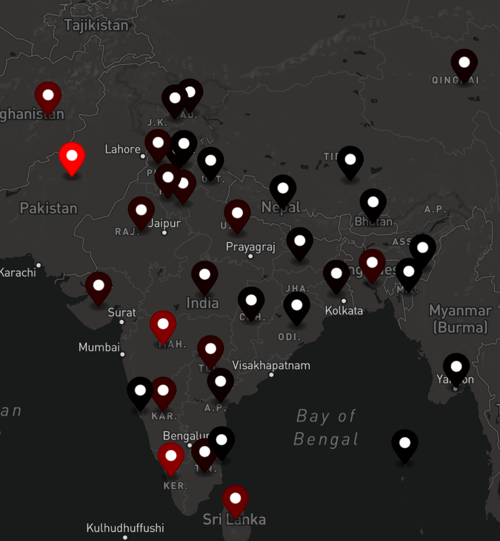
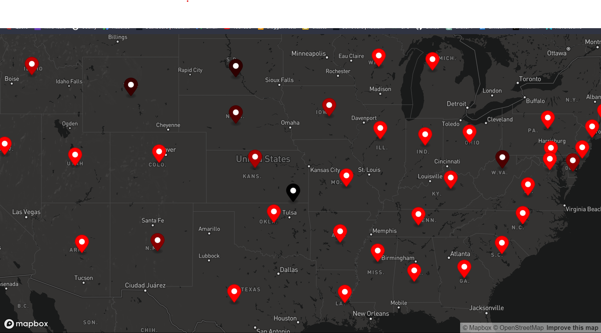

# COVID-19 Infected count visualizer on world map

## Description:

This project is built using html, css and javascript. The wolrd map is rendered by using mapbox api.

For MapBox API: `https://www.mapbox.com/`

The data is fed using json file

To run application on VS Code simply click on Go Live (Live Server).

## SAMPLES

INDIA:

USA:

### * The color of the map depends upon the number of cases.
